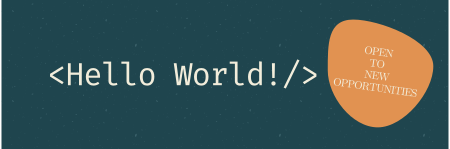
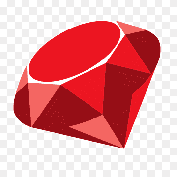

<h1 align="center">Hey there 👋, I'm Saman</h1>

<h3 align="center">A passionate software/web developer</h3>

- 🔭 I’m currently working on **Tic_Tac_Toe Project**

- 🌱 I’m currently learning **Ruby**

- 👯 I’m looking to collaborate on **CSS and/or Ruby Projects**

- 👨‍💻 All of my projects are available at (coming soon...)

- 📫 How to reach me directly **milady00126@gmail.com**

- 📄 Know about my experiences (coming soon...)

## Languages and Tools

 

	
  
<b>Programming Languages</b>

  
   

	
  
<b>Frontend Development</b>

   
   
  
  

  

	
  
<b>Backend Developement</b>

  

	
  
<b>Databases</b>

 

	
  
<b>Frameworks</b>

   

	
  
<b>Others</b>

  

## ⚙️&nbsp;GitHub Analytics

## 📫 Get in touch
 

