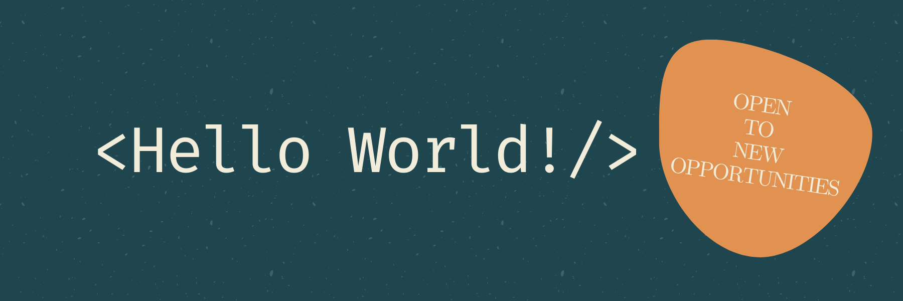

<h1 align="center">Hi 👋, I'm Saman</h1>
<h3 align="center">A passionate software/web developer from Iran</h3>

- 🔭 I’m currently working on **Tic_Tac_Toe Project**

- 🌱 I’m currently learning **Ruby**

- 👯 I’m looking to collaborate on **CSS and/or Ruby Projects**

- 👨‍💻 All of my projects are available at [coming soon...](coming soon...)

- 📫 How to reach me directly **milady00126@gmail.com**

- 📄 Know about my experiences [coming soon...](coming soon...)

<h3 align="left">Connect with me:</h3>

<h3 align="left">Languages and Tools:</h3>

        

### ⚙️ &nbsp;GitHub Analytics

